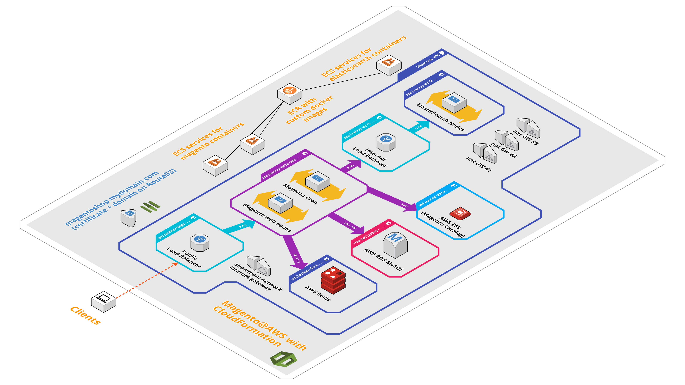

## 1) Pre-requisites & Architecture

With AWS, You need :

  - An AWS account with the ability to create these ressources:
    - EC2 instances and ELB
    - ECS services and task
    - IAM roles
    - VPC and related network items (subnet, security groups, inet and NAT gateway)
    - RDS, EFS, ElastiCache instances
    - CloudFormation stacks
  - 2 ECR :
      - a registry for Magento Docker image
      - a registry for Custom ElasticSearch docker image
  - A EC2 key pair
  - A Domain name in Route53 with one wildcard certificate (delivered for free by AWS Cerificate manager)

The target architecture :

## 2) To deploy showroom VPC and ECS

    # aws cloudformation deploy --stack-name=showroom-network --template-file=./infra/vpc-3_3_subnets.yml

    # aws cloudformation deploy --stack-name=showroom-ecs --template-file=./infra/ecs.yml --capabilities=CAPABILITY_IAM

## 3) To deploy smileshop into the showroom VPC/ECS :

Smileshop data persistence:

    # aws cloudformation deploy --stack-name=smileshop-data --template-file=./smileshop/smileshop-data.yml

SmileShop ElasticSearch nodes:

    # aws cloudformation deploy --stack-name=smileshop-es --template-file=./smileshop/smileshop-es.yml

Smileshop application:

    # aws cloudformation deploy --stack-name=smileshop-magento --template-file=./smileshop/smileshop-magento.yml

## 4) Misc :

To delete a stack:

    # aws cloudformation delete-stack --stack-name=mystack

List outputs of a stack, local script:

    # ./getStackOutputs.sh mystack
